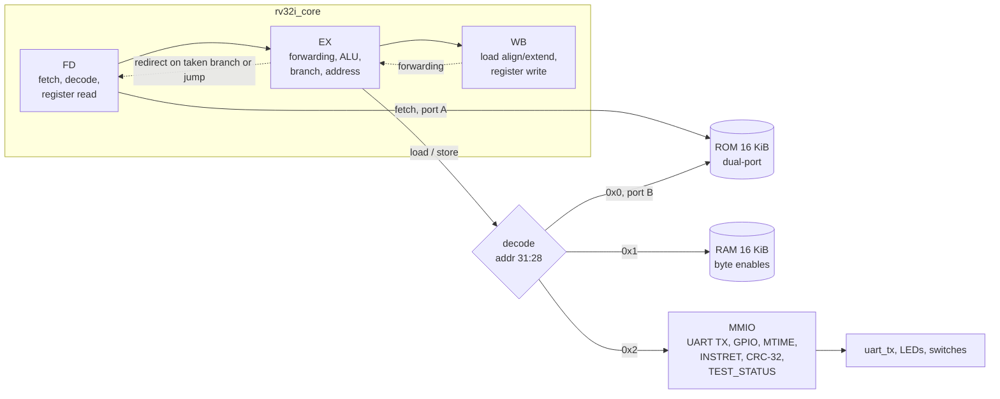

# rv32i-softcore-vhdl

A RISC-V RV32I soft-core CPU in VHDL-2008 with a small SoC (ROM, RAM, UART, GPIO, timer, CRC-32 unit) for the Terasic DE10-Lite, verified in GHDL against an independent instruction-set model.


## Context

This is a self-directed project applying the content of the modules
*Entwurf digitaler Systeme* (Design of Digital Systems, B37) and
*Rechnerarchitektur und -organisation* (Computer Architecture and Organisation, B16)
of the B.Eng. Technische Informatik – Embedded Systems at BHT Berlin.

| Module topic | Where it appears in this repository |
|---|---|
| B37: VHDL, sequential circuits, FPGA | All of `rtl/`; block-RAM-friendly memories (`rom_dp.vhd`, `ram_be.vhd`); DE10-Lite top level in `board/de10lite/` |
| B37: automata / finite state machines | UART transmitter (`uart_tx.vhd`), pipeline control and halt logic (`rv32i_core.vhd`) |
| B37: CPU (soft-core), microcontrollers | The RV32I core and the memory-mapped peripherals around it (`rv32i_soc.vhd`, `soc_mmio.vhd`) |
| B37: communication | 8N1 UART, checked bit by bit by the testbenches |
| B37: trade-offs between implementation variants | CRC-32 in software vs. MMIO accelerator, emulated vs. native multiply, pipeline design choices (Design notes) |
| B16: combinational networks, automata for process control | Instruction decoder as a pure function (`rv32i_pkg.vhd`), pipeline control |
| B16: integer arithmetic, structure of an ALU, hardware arithmetic units | `rv32i_alu.vhd` (adder/subtractor, barrel shifters, comparators), golden-vector tested |
| B16: representation of information | Two's complement and sign extension of immediates and loads, little-endian byte lanes |
| B16: native vs. emulated instructions | No M extension: `sw/common/rt_arith.c` emulates `*`, `/`, `%`; cycle cost measured |
| B16: Harvard vs. von Neumann, bus systems, components | Modified Harvard organisation, address decoder and memory map (`soc_pkg.vhd`) |
| B16: RISC, model computers | RV32I base ISA on a minimal SoC |
| B16: performance parameters, analysis of computer systems | CPI and cycle counts measured with the `MTIME`/`INSTRET` counters and by the testbench |
| B16: hardware acceleration of algorithms | CRC-32 unit: 6.7x fewer cycles than the software loop |

## Features

- **Complete RV32I base ISA**: all register/immediate ALU operations, LUI/AUIPC, JAL/JALR, all six branches, LB/LH/LW/LBU/LHU, SB/SH/SW. FENCE retires as a no-op, including FENCE.TSO, PAUSE and encodings with nonzero rd/rs1 (which the specification says to ignore); FENCE.I (Zifencei) is not implemented. ECALL and EBREAK halt the core.
- **3-stage in-order pipeline** (fetch/decode, execute, write-back) with full forwarding: one instruction per cycle, one bubble per taken branch or jump, no other stalls.
- **Precise exceptions without a trap vector**: illegal instructions, ECALL/EBREAK and misaligned fetch/load/store stop the core with the cause and PC on its outputs; older instructions complete, younger ones have no effect.
- **SoC**: 16 KiB instruction ROM (dual-ported, also readable as data), 16 KiB data RAM with byte enables, UART transmitter, 10-bit GPIO, 32-bit cycle counter (`MTIME`), retired-instruction counter (`INSTRET`), CRC-32 accelerator and a test-status register for the testbench.
- **Software built with zig** as the RISC-V cross compiler (`zig cc -target riscv32-freestanding-none -mcpu=generic_rv32`), with a small C runtime (`crt0.S`, polled UART, software multiply/divide).
- **Verification**:
  - 12 self-checking assembly test programs with 512 test cases (riscv-tests style) plus 7 tests for the halt conditions;
  - a C program ("Hello from RV32I", Fibonacci, bubble sort, CRC-32, multiply/divide) whose UART output is checked;
  - every program also runs on a Python instruction-set model; outcome, cycle count, retired instructions, halt PC, LEDs, UART text and the complete commit trace (every retired instruction with its register write and store) must match the RTL, and after a halt the whole register file (read through a debug port) must match too;
  - 34,510 golden vectors for the decoder, ALU, branch comparator and load/store lane logic;
  - a cycle-exact UART testbench, a board-level smoke test at the real baud rate, 71 pytest tests of the model and scripts;
  - a mutation check that injects 25 typical bugs into the RTL, one at a time; the suite catches all of them;
  - a synthesisability check: `ghdl --synth` of the board top level must succeed without latches and must infer the ROM and the four RAM byte lanes as memories.
- **DE10-Lite top level** with pin assignments taken from the Terasic user manual.

## Architecture



Both memory ports have a fixed latency of one cycle (address in cycle *n*, data in cycle *n*+1), which is exactly how an FPGA block RAM reads. The stages are arranged around that latency:

| Stage | Work | Memory interaction |
|---|---|---|
| FD | decode the word the ROM returns, read two registers | the ROM output register acts as the instruction register |
| EX | select forwarded operands, ALU, branch decision, effective address, byte enables | drives the next fetch address and the data address/store |
| WB | align and sign-extend load data, write the register file | load data arrives from RAM/ROM/MMIO |

A taken branch resolves in EX and costs one bubble:

| Cycle | 1 | 2 | 3 | 4 |
|---|---|---|---|---|
| FD | `beq` | `i+1` (squashed) | target | target+1 |
| EX |  | `beq` taken | bubble | target |
| WB |  |  | `beq` | bubble |

### Memory map

| Address | Size | Contents |
|---|---|---|
| `0x0000_0000` | 16 KiB | ROM: code and read-only data (fetch port A, load port B) |
| `0x1000_0000` | 16 KiB | RAM: data and stack (repeats every 16 KiB within the region) |
| `0x2000_0000` | 64 words | MMIO registers |

| Offset | Register | Access |
|---|---|---|
| `0x00` | `UART_DATA` | W: send a byte (ignored while busy) |
| `0x04` | `UART_STATUS` | R: bit 0 = busy |
| `0x10` | `GPIO_OUT` | RW: LEDs (10 bits) |
| `0x14` | `GPIO_IN` | R: switches, two-flop synchronised |
| `0x20` | `MTIME` | RW: increments every clock cycle |
| `0x24` | `INSTRET` | RW: increments for every retired instruction |
| `0x30` | `CRC_STATE` | RW: CRC-32 register |
| `0x34` | `CRC_DATA` | W: fold one byte into `CRC_STATE` in one cycle |
| `0x40` | `TEST_STATUS` | W: 1 = pass, `(n << 1) \| 1` = test case *n* failed |

## Build & test

Requirements: GHDL (VHDL-2008, any backend; CI uses the Ubuntu package, development used GHDL 6.0 mcode) and Python 3 (CI uses 3.12, development used 3.13). zig is only needed to rebuild the ROM images, which are committed.

```sh
sudo apt-get install ghdl
pip install pytest

python -m pytest -q tests          # reference model and scripts (71 tests)
python scripts/run_tests.py        # all testbenches and programs, exit code != 0 on failure
python scripts/run_tests.py -k hazard --report build/cycles.md   # one program, cycle table

python scripts/mutation_check.py   # inject 25 RTL bugs one at a time, each must be caught (about 6 min)
python scripts/synth_check.py      # ghdl --synth of the board top: no latches, ROM/RAMs inferred

pip install ziglang==0.16.0        # RISC-V cross compiler (clang + lld)
python scripts/build_sw.py         # rebuild sw/images/*.hex and board/de10lite/rom_image_pkg.vhd
python scripts/build_sw.py --check # rebuild into a temporary directory, compare with the committed files

python scripts/rv32i_iss.py sw/images/hello.hex   # run a program on the reference model only
```

`run_tests.py` analyses the sources into `build/ghdl`, writes commit traces to `build/trace` and runs the programs in parallel; the whole suite takes about 17 s on a laptop.

**Windows**: the same commands work in PowerShell or Git Bash with the Windows build of GHDL on `PATH` (or passed with `--ghdl`). Development and all local runs were done this way.

**FPGA**: open `board/de10lite/de10lite.qpf` in Quartus Prime Lite. The project lists all sources, pins and timing constraints. Quartus synthesis has not been run yet (only GHDL's generic synthesis, see Limitations).

## Results

The two tables come from `python scripts/run_tests.py --report` and from the UART output of the C program; RTL and reference model agree on every number in them.

**Test programs** (cycles from reset release until the testbench sees the result):

| Program | Result | Cycles | Instructions | CPI |
|---|---|---:|---:|---:|
| arith | pass | 375 | 372 | 1.008 |
| branch | pass | 460 | 344 | 1.337 |
| compare | pass | 544 | 541 | 1.006 |
| hazard | pass | 207 | 194 | 1.067 |
| jump | pass | 131 | 105 | 1.248 |
| load | pass | 269 | 266 | 1.011 |
| logic | pass | 499 | 496 | 1.006 |
| mmio | pass | 434 | 342 | 1.269 |
| shift | pass | 602 | 599 | 1.005 |
| store | pass | 281 | 278 | 1.011 |
| system | pass | 86 | 83 | 1.036 |
| upper | pass | 82 | 79 | 1.038 |
| halt_ecall / halt_ebreak / halt_illegal | halt as expected | 7 | 4 | |
| halt_misaligned_fetch / _load / _store / _jump | halt as expected | 7 to 9 | 4 to 6 | |
| hello (C) | pass | 190353 | 167142 | 1.139 |

The branch-heavy tests show the one-cycle penalty of taken branches; straight-line code runs at a CPI of 1.0. The CPI of `hello` as a whole includes polling the UART (the testbench uses 8 clocks per bit to keep simulations short).

**Kernels of the C program**, measured on the core itself with `MTIME` and `INSTRET` (the measurement windows contain no UART output, so the numbers do not depend on the baud rate):

| Kernel | Cycles | Instructions | CPI |
|---|---:|---:|---:|
| `fib_iter(47)` | 289 | 242 | 1.19 |
| `fib_rec(15)` (recursive) | 28011 | 25284 | 1.10 |
| bubble sort, 48 words | 11040 | 10069 | 1.09 |
| CRC-32 in software, 9 bytes | 382 | 373 | 1.02 |
| CRC-32 in software, 256 bytes | 10255 | 10000 | 1.02 |
| CRC-32 with the MMIO unit, 256 bytes | 1541 | 1286 | 1.19 |
| 32 products via `__mulsi3`, operands from an LCG | 20733 | 18123 | 1.14 |
| one emulated 32-bit division | 471 | 438 | 1.07 |

The CRC-32 unit needs 6.7 times fewer cycles than the bit-serial software loop; at about 6 cycles per byte, the loop that feeds it one store per byte is now the limit, not the unit. A single emulated 32-bit division (restoring division, one quotient bit per loop iteration) costs 471 cycles, which is the price of RV32I having no divide instruction.

**Mutation check** (`scripts/mutation_check.py`, 360 s locally): every one of the 25 injected bugs makes at least one testbench fail, and in every case a self-check fails (a program's own result, LEDs, UART text or expected register values, or a unit testbench), not only the comparison with the reference model.

<details>
<summary>Injected bugs and the tests that caught them</summary>

| Injected bug | Caught by |
|---|---|
| ALU: SRA shifts in zeros | tb_core_vectors, hello, shift |
| ALU: SLT compares unsigned | tb_core_vectors, compare |
| ALU: shift amount taken from 6 bits | tb_core_vectors, shift |
| ALU: SUB adds | tb_core_vectors, arith, hazard, hello, mmio, upper |
| decode: SRAI decoded as SRLI | hello, shift |
| decode: writes to x0 not suppressed | tb_core_vectors and most programs |
| decode: B-immediate bit 11 taken from instr[31] | tb_core_vectors, branch |
| decode: FENCE illegal | tb_core_vectors, system |
| decode: RV32M MUL accepted as ADD | tb_core_vectors, halt_illegal |
| branch: BGE is strict | tb_core_vectors, branch, hello |
| load: LH zero-extends | tb_core_vectors, load, store |
| store: SH upper half uses the wrong byte lanes | tb_core_vectors, store |
| pipeline: no WB-to-EX forwarding on rs2 | most programs |
| pipeline: forwarding ignores the valid bit (squashed instruction forwarded) | hazard, hello, jump |
| register file: no write-through | most programs |
| pipeline: instruction behind a taken branch not squashed | tb_de10lite and most programs |
| JALR: bit 0 of the target not cleared | jump |
| JAL: link register gets pc instead of pc + 4 | hazard, hello, jump |
| misaligned loads not detected | halt_misaligned_load |
| imprecise halt: the older instruction in WB loses its register write | all seven halt tests |
| UART: bit period one cycle too long | tb_uart_tx, tb_de10lite, hello, mmio |
| UART: write while busy restarts the frame | tb_uart_tx, mmio |
| MTIME not writable | mmio |
| CRC unit with a wrong polynomial | hello, mmio |
| RAM stores ignore the byte enables | hello, store |

</details>

## Project layout

```
rtl/core/        rv32i_pkg (types, decoder, immediates, load/store lanes), ALU, register file, pipeline
rtl/soc/         SoC top, address decode, dual-port ROM, byte-enable RAM, MMIO peripherals, UART TX
board/de10lite/  DE10-Lite top level, generated ROM package, Quartus project (.qpf/.qsf/.sdc)
tb/              tb_soc (programs), tb_core_vectors (golden vectors), tb_uart_tx, tb_de10lite, sim_pkg
sw/common/       crt0, linker script, memory map header, UART/test helpers, soft multiply/divide, test macros
sw/tests/        self-checking assembly tests, one file per instruction group, and the halt tests
sw/apps/hello/   C demo and self-test program with its expected UART output
sw/images/       committed ROM images (.hex, one word per line)
scripts/         build_sw.py, run_tests.py, rv32i_iss.py (reference model), gen_vectors.py, mutation_check.py, synth_check.py
tests/           pytest tests of the reference model and the scripts
```

## Design notes

- **Why three stages.** With synchronous block RAMs the fetch address must be presented one cycle before the instruction is decoded, and load data arrives one cycle after the address. Putting decode and register read in the cycle where the ROM output appears, and alignment in the cycle where the load data appears, gives a pipeline with no load-use stall at all: the load result is forwarded straight from WB into EX. The cost is a long combinational path in that cycle (block-RAM output, alignment, forwarding mux, ALU, branch decision, next fetch address). A five-stage design would shorten it but needs load-use interlocks and more forwarding; for a 50 MHz target the shorter pipeline was the simpler choice, but its timing is unverified.
- **Branches** use static not-taken prediction and resolve in EX, so the penalty is exactly one cycle and CPI = 1 + (taken branches and jumps / instructions). The reference model relies on this rule to predict every `MTIME` read and the total cycle count, which is why cycle counts can be compared exactly.
- **Forwarding** needs only one path (WB to EX) because the register file is write-through: an instruction two behind its producer reads the new value directly. `decode()` clears the write enable for `rd = x0`, so neither the register file nor the forwarding logic needs a special case for x0.
- **Modified Harvard organisation.** Fetch has its own ROM port, so instruction and data accesses never compete and there are no structural stalls. The ROM's second port lets programs load constants, string literals and `.data` initialisers (copied to RAM by `crt0.S`). Instructions cannot be fetched from RAM; a von Neumann variant would need a shared port and an arbiter with stalls.
- **Misaligned accesses trap** (here: halt) instead of being split into two accesses. The ISA allows either; splitting would need a multi-cycle load/store unit and complicates the precise-exception logic, while code compiled for naturally aligned data does not produce misaligned accesses. Byte and halfword stores replicate their data into all lanes and select with byte enables, so the store path has no shifter.
- **ECALL/EBREAK/illegal instructions halt** the core, because there is no Zicsr and no trap vector. The halt is precise: the faulting instruction and the one behind it are discarded, the older one in WB still retires. The halt tests check this through the LEDs (a store behind the fault must not happen) and through the register file, which the testbench reads after the halt via a debug port of the register file (unconnected on the board, so synthesis removes it).
- **Register file** reads are asynchronous, so they map to logic elements rather than M9K blocks (whose reads are registered). About 1 k flip-flops is cheap on the 10M50 and keeps decode and register read in one stage.
- **CRC-32 unit**: the eight shift/XOR steps of the bitwise algorithm are unrolled into one XOR network, so a byte is absorbed per cycle. It shows the B16 point about hardware acceleration: the speed-up is limited by how fast software can feed it.
- **Verification strategy.** Three independent sources of truth: the expected values written into the self-checking tests, a Python model written from the specification (not translated from the VHDL), and the expected results in the C program, computed separately in Python (`zlib.crc32`, plain integer arithmetic). The model is itself checked against encodings produced by the LLVM assembler and against the tests' expectations, so a bug in the model cannot make a buggy core look correct. The mutation check confirms that the tests fail when the RTL is wrong. Its first runs found two gaps: an imprecise halt (the older instruction losing its register write) was invisible because nothing executes after a halt, and a JALR that kept bit 0 of its target was caught only by the model comparison, because instruction fetch ignores the low address bits. The register-file debug port and the AUIPC checks in `jump.S` close these gaps.
- **Toolchain.** `zig cc` bundles clang and lld for RISC-V, so one `pip install` provides the cross compiler on any host. `build_sw.py` rejects compiled code containing anything outside RV32I. The images are committed so the simulation runs without zig, and CI rebuilds them to prove they match the sources.

## Limitations & next steps

- **Not synthesised for the FPGA, not tested on hardware.** The design is verified in simulation only. GHDL's technology-independent synthesis of the board top level succeeds (memories inferred, no latches), and the DE10-Lite pin assignments come from the Terasic manual, but Quartus has not been run, so resource use and Fmax are unknown; the single-cycle path through load alignment, forwarding, ALU and branch decision may not meet 50 MHz without a PLL or an extra stage.
- No Zicsr, interrupts or trap handling; exceptions halt the core. No M extension (multiply/divide are emulated in software), no compressed instructions.
- Instructions can only come from the ROM; there is no bootloader and no way to load programs without rebuilding the bitstream.
- UART transmit only; no receiver.
- The official `riscv-arch-test` compliance suite has not been run; coverage comes from this repository's own tests.
- Next steps: Quartus synthesis and timing report, UART receiver with a bootloader into RAM, Zicsr with machine-mode traps and a timer interrupt, the M extension, and running `riscv-arch-test`.

## License

MIT, see [LICENSE](LICENSE).
